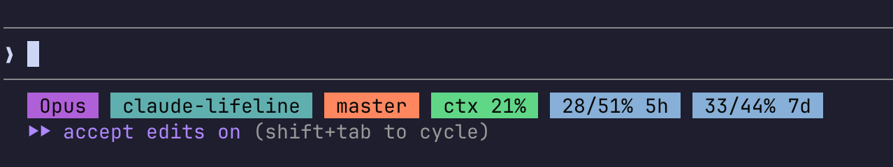

# claude-lifeline

A fast Rust status line for [Claude Code](https://docs.anthropic.com/en/docs/claude-code), replacing the default status bar with a feature-rich, sub-50ms native binary. Supports **macOS**, **Linux**, and **Windows**.

**[中文文档](docs/README_CN.md)**

## Preview

Single-line color-block bar with everything inline.



```
 Opus 4.7 1M  claude-lifeline  master  +95 -442  ctx 21%  100% 3m19s  3/28%  63/68%  S:87/68%! →5/13 16:08 ↓1d8h
```

## Why claude-lifeline?

Claude Code's default status bar shows basic usage percentages — but that tells you nothing about whether you're *on track* to last the full window.

claude-lifeline adds **pace intelligence**: it compares your actual consumption rate against the ideal pace for each quota window, and warns you before you burn out.

### What you get at a glance

- **Over-pace alert `!`** — appended to the quota when actual usage runs ahead of the elapsed-time pace
- **Depletion ETA `→HH:MM`** — predicts the local time your quota hits 100% at the current burn rate (only shown when over-pace)
- **Recovery wait `↓Xh`** — tells you how long to pause so your pace catches up
- **Sonnet sub-quota alert** — when Sonnet-specific usage outruns pace, an extra `S:U/P%!` block appears next to the regular 7d block (hidden otherwise)

### Optional segments (off by default)

Opt-in via `~/.claude/claude-lifeline/config.toml`:

- **Subscription badge** (`display.subscription`) — shows the plan parsed from OAuth credentials, e.g. `MAX·20x`, `MAX·5x`, `PRO`, `FREE`
- **Opus 7d sub-quota** (`display.seven_day_opus`) — mirrors the Sonnet sub-quota for Opus; shown as `O:U/P%!` only when over-pace
- **Extra-usage credit pool** (`display.extra_usage`) — surfaces the monthly paid top-up balance as `$5.4K/20K 27%` (USD) or `[XYZ] used/limit pct%` for other currencies; auto-hidden when the pool is not enabled on your account

### Also included

- Git branch, dirty status, ahead/behind upstream
- Session edit stats (`+lines_added` / `-lines_removed`)
- Configurable segments — toggle context, 5h quota, 7d quota, edit stats, plus the optional segments above via TOML
- **~30ms** response, **~3MB** binary, zero runtime dependencies (static on Linux/Windows, signed on macOS)

## Install

Requires **Claude Code ≥ 2.1.80** (for `stdin.rate_limits` data).

### Let AI install it for you (Recommended)

Share this repo URL with Claude Code — it will read the instructions below and complete the installation.

> **AI agents**: To install claude-lifeline, follow these steps:
> 1. Detect the user's platform and download the correct binary from the [latest release](https://github.com/xjoker/claude-lifeline/releases/latest):
>    - macOS Apple Silicon: `claude-lifeline-aarch64-apple-darwin`
>    - macOS Intel: `claude-lifeline-x86_64-apple-darwin`
>    - Linux x86_64: `claude-lifeline-x86_64-unknown-linux-musl`
>    - Linux ARM64: `claude-lifeline-aarch64-unknown-linux-musl`
>    - Windows x86_64: `claude-lifeline-x86_64-pc-windows-msvc.exe`
> 2. Save the binary to `~/.claude/bin/claude-lifeline` (Windows: `%USERPROFILE%\.claude\bin\claude-lifeline.exe`), create the directory if it doesn't exist, make it executable (`chmod +x`), and on macOS run `xattr -d com.apple.quarantine ~/.claude/bin/claude-lifeline` to bypass Gatekeeper
> 3. Edit `~/.claude/settings.json` — add or merge the following key into the existing JSON:
>    ```json
>    "statusLine": { "type": "command", "command": "~/.claude/bin/claude-lifeline", "refreshInterval": 15 }
>    ```
>    Do NOT overwrite the entire file — preserve all existing settings. `refreshInterval: 15` keeps the quota ETA close to live. If the user already has a custom `refreshInterval`, leave it untouched.
> 4. Tell the user to restart Claude Code to activate the new status line.

### Manual install

**macOS / Linux:**

```bash
curl -fsSL https://raw.githubusercontent.com/xjoker/claude-lifeline/master/install.sh | bash
```

**Windows (PowerShell):**

```powershell
irm https://raw.githubusercontent.com/xjoker/claude-lifeline/master/install.ps1 | iex
```

Restart Claude Code after installation.

### Build from source

One-shot dev install — builds with cargo, deploys to `~/.claude/bin/`, and merges `settings.json`:

```bash
# macOS / Linux
git clone https://github.com/xjoker/claude-lifeline.git
cd claude-lifeline
bash install.sh dev
```

```powershell
# Windows (PowerShell)
git clone https://github.com/xjoker/claude-lifeline.git
cd claude-lifeline
$env:ACTION='dev'; .\install.ps1
```

Or manual:

```bash
cargo build --release
mkdir -p ~/.claude/bin
cp target/release/claude-lifeline ~/.claude/bin/
```

Then add to `~/.claude/settings.json`:

```json
{
  "statusLine": {
    "type": "command",
    "command": "~/.claude/bin/claude-lifeline",
    "refreshInterval": 15
  }
}
```

### Upgrade

```bash
# macOS / Linux
curl -fsSL https://raw.githubusercontent.com/xjoker/claude-lifeline/master/install.sh | bash -s upgrade
```

Windows: re-run the install command — it auto-detects and skips if already up to date.

### Uninstall

```bash
# macOS / Linux
curl -fsSL https://raw.githubusercontent.com/xjoker/claude-lifeline/master/install.sh | bash -s uninstall
```

```powershell
# Windows (PowerShell)
& { $env:ACTION='uninstall'; irm https://raw.githubusercontent.com/xjoker/claude-lifeline/master/install.ps1 | iex }
```

## Layout

A compact single-line bar with everything inline as colored blocks.

```
 Opus 4.7 1M  claude-lifeline  master  +95 -442  ctx 21%  3/28%  63/68%  S:87/68%! →5/13 16:08 ↓1d8h
 ^^^^^^^^^^^  ^^^^^^^^^^^^^^^  ^^^^^^  ^^^^^^^^  ^^^^^^^  ^^^^^  ^^^^^^  ^^^^^^^^^^^^^^^^^^^^^^^^^^
 Model        Project          Git     Edits     Context  5h     7d      Sonnet 7d (over-pace only)
```

### Block breakdown

| Block | Content | Background |
|-------|---------|------------|
| Model | `Opus 4.7` / `Sonnet 4.6` / `Haiku 4.5` / `Opus 4.7 1M` etc. | **Intensity-coded** — see table below |
| Project | `cwd` basename, truncated to 16 cols with `..` if longer | Cadet teal |
| Git | `branch[*][ ↑N][ ↓N]` — branch name truncated to 16 cols | Warm orange |
| Edits | `+lines_added -lines_removed` from Claude Code's session counter | Neutral gray |
| Context | `ctx N%` | **Green / Yellow / Red** by threshold |
| 5h / 7d quota | `U/P%` (e.g., `3/28%`); over-pace adds `!`, depletion ETA, recovery wait | **Blue / Yellow / Red** by threshold + over-pace |
| Sonnet 7d | `S:U/P%!` — only appears when Sonnet usage exceeds pace | Yellow / Red |
| Subscription *(opt-in)* | `MAX·20x` / `MAX·5x` / `PRO` / `FREE` — plan parsed from OAuth credentials | Desaturated purple (256 #60) |
| Opus 7d *(opt-in)* | `O:U/P%!` — only appears when Opus usage exceeds pace | Yellow / Red |
| Extra-usage *(opt-in)* | `$5.4K/20K 27%` (USD) or `[XYZ] used/limit pct%` for the monthly paid pool | **Blue / Yellow / Red** by utilization vs 7d thresholds |

### Model intensity colors

The model block hue reflects tier:

| Model | Background | Meaning |
|-------|-----------|---------|
| `Opus` | Violet-magenta (256 #134) | Flagship — most capable |
| `Sonnet` | Violet (256 #99) | Balanced |
| `Haiku` | Cyan (256 #38) | Light & fast |
| Other / unknown | Gray (256 #102) | Fallback |

### Context color thresholds

| Color | Threshold |
|-------|-----------|
| Green | `< 60%` |
| Yellow | `60–70%` |
| Red | `≥ 70%` |

### Quota color thresholds

| Color | Condition |
|-------|-----------|
| Blue | usage `< yellow_at` AND on pace |
| Yellow | `yellow_at ≤ usage < red_at` OR over-pace |
| Red | usage `≥ red_at` |

Defaults: `yellow_at = 75 / red_at = 90` for 5h, `yellow_at = 80 / red_at = 90` for 7d.

### Over-pace indicator

When a quota's actual usage exceeds the elapsed-time pace, the block:

1. Switches to yellow (or stays red if already `≥ red_at`)
2. Appends `!` after the percentage pair
3. Appends ` →HH:MM` showing the projected depletion time (cross-day uses `M/D HH:MM`)
4. Appends ` ↓Xh` showing how long to pause for pace to catch up

```
85/23%! →9:35 ↓2h
^^ ^^   ^^^^^ ^^^^
│  │    │     └─ Pause ~2h to align with pace
│  │    └─ Predicted depletion at 09:35 local
│  └─ Pace position: 23% of the 5h window has elapsed
└─ 85% of the 5h quota consumed (way ahead of pace)
```

### Sonnet sub-quota

When Sonnet has its own quota cap (some Max plans), `seven_day_sonnet` from the usage API tracks that separately. The Sonnet block only renders **when Sonnet usage exceeds pace** — quiet by design, alerts you only when you're burning Sonnet faster than the 7-day window allows.

```
63/68%  S:87/68%! →5/13 16:08 ↓1d8h
^^^^^^  ^^^^^^^^^^^^^^^^^^^^^^^^^^^
│       └─ Sonnet at 87% with only 68% of the 7d window elapsed — over-pace
└─ Overall 7d at 63% (within pace, normal blue)
```

### Width-aware wrapping

The bar auto-adapts to the terminal width:

- **Wide enough** → all blocks on one line
- **Narrow** → splits into two lines: `model + project + git + edits` on line 1, `ctx + 5h + 7d + sonnet` on line 2
- **Very narrow** → one block per line

The 1-column gap between blocks ensures adjacent same-color segments stay distinguishable without separator characters.

> About edit stats: the `+X -Y` figures come from Claude Code's `cost.total_lines_added` / `total_lines_removed` — a session-scoped counter that tallies every line touched by the Edit and Write tools. It is **not** filtered by `.gitignore`, and it does **not** correspond to `git diff`. Reset when you start a new session.

## Configuration

Optional config file at `~/.claude/claude-lifeline/config.toml`.

```toml
[display]
context        = true   # Context window block
five_hour      = true   # 5-hour quota block
seven_day      = true   # 7-day quota block (also gates Sonnet sub-quota block)
edit_stats     = true   # +lines_added / -lines_removed from Claude Code's session counter

# Optional segments — all default OFF so upgrades don't change your UI silently
subscription   = false  # Plan badge from OAuth credentials (e.g. MAX·20x, PRO)
seven_day_opus = false  # Opus 7d sub-quota (`O:U/P%!`, over-pace only)
extra_usage    = false  # Monthly paid credit pool (auto-hidden if pool is not enabled)

# Color thresholds (optional — defaults shown below)
# Validation: each yellow_at must be < red_at and within [0, 100];
#             invalid pairs fall back to the defaults below while other
#             fields stay as-is.
[thresholds]
ctx_yellow_at       = 60.0   # ctx >= this → yellow
ctx_red_at          = 70.0   # ctx >= this → red

# 5h / 7d quotas are tuned independently. 7d defaults are looser than 5h
# because the longer reset window makes mid-range usage less urgent.
five_hour_yellow_at = 75.0
five_hour_red_at    = 90.0
seven_day_yellow_at = 80.0
seven_day_red_at    = 90.0

# Over-pace tolerance in percent. With pace_tolerance = 0 (strict), any
# usage above the elapsed-time pace marker triggers the `!` alert. Raise
# it to absorb short-lived bursts — e.g., pace_tolerance = 5.0 means
# "only alert when we're >5% ahead of pace".
pace_tolerance      = 0.0
```

See [config.example.toml](config.example.toml) for reference.

## CLI Commands

Starting with **0.4.0**, `claude-lifeline` is more than a status line. Running it
with no arguments (the way Claude Code invokes it) keeps the original
stdin-driven status-line behaviour, but the same binary now offers:

```bash
claude-lifeline tui               # Interactive ratatui dashboard:
                                  # · Sessions list across all projects
                                  # · Live 5h / 7d / Opus quota gauges
                                  # · Today / 7d / all-time rollups
                                  # · Config toggles (writes back to TOML)
                                  # Keys: tab/1-4 switch, j/k navigate,
                                  #       space/enter toggle, r refresh,
                                  #       q/esc quit

claude-lifeline config show       # Print resolved config
claude-lifeline config path       # Print path to config.toml
claude-lifeline config edit       # Open config.toml in $EDITOR
claude-lifeline config init       # Seed config.toml from defaults

claude-lifeline update check      # Compare local version to GitHub release
claude-lifeline update run        # Download and atomically replace the
                                  # running binary with the latest release
                                  # asset for this platform

claude-lifeline doctor            # Diagnostic report: PATH, data dir,
                                  # credentials, transcript count, and
                                  # Claude Code statusLine integration
```

The TUI scans `~/.claude/projects/**/*.jsonl` on each refresh — no shared
session-state file is written, so it is safe to keep open while multiple
Claude Code windows are active.

## Data Sources

Rate limit data is resolved in priority order:

| Priority | Source | Notes |
|----------|--------|-------|
| 1 | `stdin.rate_limits` | Claude Code ≥ 2.1.80, no auth needed; provides `five_hour` + `seven_day` only |
| 2 | Local cache | `~/.claude/claude-lifeline/usage-cache.json`, 5min TTL; preserves Sonnet data across rate_limits writes |
| 3 | API fallback | `api.anthropic.com/api/oauth/usage`, 2s timeout; provides Sonnet/Opus sub-quotas and the extra-usage credit pool |
| 4 | Empty | Quota segments not displayed |

### Credentials

For the API fallback, OAuth token is read from:

1. `~/.claude/.credentials.json` (Linux / Windows / older macOS)
2. **macOS Keychain** — `security find-generic-password -s "Claude Code-credentials"` fallback for Claude.app installs where the credential file is absent

The same source also supplies `subscriptionType` (e.g. `max` / `pro`) and `rateLimitTier` (e.g. `default_claude_max_20x`) for the optional subscription badge — no separate API call is made.

## Performance

- **~30ms** response time (well under Claude Code's 500ms budget)
- **~3MB** release binary (LTO + strip)
- Git commands, usage data fetch run concurrently via `tokio::join!`
- All binaries are fully static (musl on Linux, static CRT on Windows)

## Supported Platforms

| Platform | Architecture | Binary |
|----------|-------------|--------|
| macOS | Apple Silicon (arm64) | `claude-lifeline-aarch64-apple-darwin` |
| macOS | Intel (x86_64) | `claude-lifeline-x86_64-apple-darwin` |
| Linux | x86_64 | `claude-lifeline-x86_64-unknown-linux-musl` (static) |
| Linux | ARM64 | `claude-lifeline-aarch64-unknown-linux-musl` (static) |
| Windows | x86_64 | `claude-lifeline-x86_64-pc-windows-msvc.exe` (static CRT) |

## Changelog

See [docs/CHANGELOG.md](docs/CHANGELOG.md).

## License

MIT — see [LICENSE](LICENSE).
